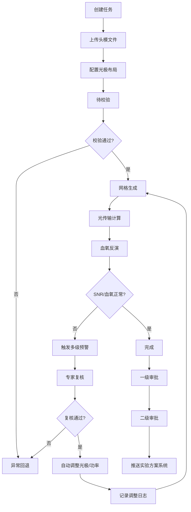
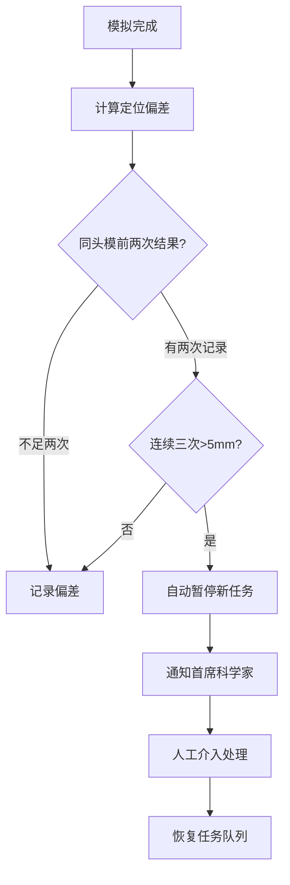

## 1. 产品概述

高精度近红外光谱（fNIRS）脑功能成像模拟与血氧浓度反演平台，面向神经科学研究人员和临床工程师，提供从三维光传输建模、实时血氧监控到智能报告生成的全流程模拟解决方案。

- 解决问题：传统fNIRS实验依赖繁琐的物理设备调试和参数试错，缺乏高精度仿真和智能优化手段
- 目标用户：成像专家、神经科学研究员、临床工程师、首席科学家
- 核心价值：将实验周期缩短60%，通过智能推荐和自动调优提升模拟信噪比30%以上

## 2. 核心功能

### 2.1 用户角色

| 角色 | 注册方式 | 核心权限 |
|------|----------|----------|
| 研究员 | 平台注册 | 上传头模、创建模拟任务、查看结果、导出数据 |
| 成像专家 | 平台注册+资质认证 | 全部研究员权限 + 预警复核、参数调整审批 |
| 审批人 | 平台注册+高级认证 | 模拟结果两级审批、推送至实验方案系统 |
| 首席科学家 | 平台注册+最高权限 | 全局监控、偏差异常处理、系统配置 |
| 系统管理员 | 后台创建 | 用户管理、权限配置、系统日志 |

### 2.2 功能模块

1. **综合看板**：日统计概览、性能雷达图、任务趋势、实时预警
2. **任务管理中心**：任务列表、状态流转看板、新建模拟任务、任务详情
3. **三维光传输模拟**：头模文件上传、光极布局配置、网格生成可视化、光学属性初始化
4. **实时监控中心**：通道信噪比监控、血红蛋白浓度变化曲线、多级预警推送
5. **专家复核与智能调优**：预警复核流程、光极间距/光源功率自动调整、调整日志追踪
6. **报告生成与数据导出**：综合PDF报告、光密度曲线、血氧浓度分布图、激活区域定位、按脑区/光极导出数据
7. **智能推荐引擎**：历史模拟分析、最优光极布局推荐、波长组合推荐
8. **审批流程中心**：两级审批流程、审批记录、偏差监控、首席科学家通知
9. **系统设置**：阈值配置、通知设置、用户管理

### 2.3 页面详情

| 页面名称 | 模块名称 | 功能描述 |
|-----------|-------------|---------------------|
| 综合看板 | 统计概览卡片 | 展示今日完成率、平均信噪比、优化收敛次数、异常预警数 |
| 综合看板 | 性能雷达图 | 六维性能评估：精度、效率、稳定性、收敛性、信噪比、覆盖率 |
| 综合看板 | 任务趋势图 | 近7日模拟任务数量和完成率趋势 |
| 综合看板 | 实时预警列表 | 当前活跃预警和处理状态 |
| 任务管理 | 任务列表 | 支持按状态、时间、头模筛选的任务表格 |
| 任务管理 | 状态流转看板 | 六列看板：待校验、网格生成、光传输计算、血氧反演、完成、异常回退 |
| 任务管理 | 新建任务向导 | 头模上传→光极布局→参数配置→确认提交四步向导 |
| 任务管理 | 任务详情页 | 任务基本信息、状态时间线、计算进度、参数配置 |
| 三维模拟 | 头模上传区 | 支持NIfTI、STL、OBJ格式，预览分割结果 |
| 三维模拟 | 光极布局编辑器 | 2D脑区映射+3D视图，支持拖拽调整光极位置 |
| 三维模拟 | 网格生成面板 | 网格参数配置、生成进度、质量指标展示 |
| 三维模拟 | 光学属性配置 | 各组织层（头皮、颅骨、灰质、白质）的吸收系数、散射系数配置 |
| 实时监控 | 通道信噪比面板 | 32通道实时SNR柱状图，阈值线高亮，低于阈值标红 |
| 实时监控 | 血氧浓度曲线 | HbO/HbR/HbT三种浓度实时折线图，支持按通道选择 |
| 实时监控 | 预警中心 | 一级/二级/三级预警列表，推送状态，响应时间统计 |
| 专家复核 | 待复核列表 | 预警详情、通道数据、异常原因分析 |
| 专家复核 | 调整方案生成 | 自动推荐光极间距/功率调整方案，支持手动修改 |
| 专家复核 | 调整日志 | 所有参数调整历史记录，包含调整前后对比 |
| 报告中心 | 报告预览 | 综合报告在线预览，含光密度曲线、血氧分布图、激活区域 |
| 报告中心 | 数据导出 | 按脑区/光极编号导出CSV/Excel格式全场数据 |
| 推荐引擎 | 布局推荐 | 基于历史数据的Top5光极布局方案推荐 |
| 推荐引擎 | 波长推荐 | 最优波长组合推荐，含预期性能指标 |
| 审批中心 | 待审批列表 | 模拟结果两级审批，审批意见填写 |
| 审批中心 | 偏差监控 | 同头模连续三次偏差超过5mm的自动暂停机制 |
| 审批中心 | 通知中心 | 首席科学家通知记录，消息推送状态 |

## 3. 核心流程

### 3.1 模拟任务主流程

用户创建模拟任务→上传头模分割文件→配置光极布局参数→系统自动校验→网格生成→三维光传输计算→血氧浓度反演→实时监控SNR和血氧→若异常触发预警→专家复核→自动调整参数重跑→模拟完成→一级审批→二级审批→推送至实验方案系统

### 3.2 偏差监控流程

同头模模拟完成→计算激活区域定位偏差→与前两次结果比对→连续三次偏差>5mm→自动暂停新任务→通知首席科学家→人工介入处理→恢复任务队列

## 4. 用户界面设计

### 4.1 设计风格

- **主色调**：深空蓝 `#0A1628` 作为背景主色，体现科研平台的专业与精准
- **辅助色**：科技青 `#00D4FF` 用于数据高亮和交互元素，生物绿 `#00FF9D` 用于正常状态，警示橙 `#FF8A00` 和 警戒红 `#FF3B5C` 用于预警层级
- **字体**：使用 JetBrains Mono 作为等宽数据字体，配合思源黑体 Noto Sans SC 作为界面字体，营造严谨的科研工具氛围
- **按钮风格**：直角微圆角（4px），固态填充带微妙内发光，悬停时辉光扩散效果
- **布局风格**：深色仪表盘布局，左侧固定导航栏，顶部状态栏，主内容区采用卡片式网格布局
- **视觉特效**：数据网格背景、扫描线动效、数据流光、呼吸灯预警指示
- **图标**：使用 Lucide 线性图标，统一 1.5px 描边

### 4.2 页面设计概览

| 页面名称 | 模块名称 | UI元素 |
|-----------|-------------|-------------|
| 综合看板 | 统计卡片 | 渐变边框、数值动效、趋势箭头、半透明玻璃态背景 |
| 综合看板 | 雷达图 | 深色填充+霓虹青边框，数据点脉冲动画 |
| 综合看板 | 趋势图 | 面积图渐变填充，数据点悬停详情 |
| 任务看板 | 状态列 | 彩色状态标识条，卡片拖拽，任务数量徽章 |
| 任务看板 | 任务卡片 | 任务ID、头模缩略图、进度条、状态标签 |
| 三维模拟 | 3D视图 | Three.js渲染，脑组织半透明分层，光极高亮发光 |
| 三维模拟 | 光极布局 | 2D脑区轮廓图，光极可拖拽，连线显示通道 |
| 实时监控 | SNR面板 | 多通道柱状图，阈值参考线，低于阈值红色闪烁 |
| 实时监控 | 血氧曲线 | 三线对比图（HbO红/HbR蓝/HbT紫），实时数据点更新 |
| 预警中心 | 预警列表 | 三级颜色标识（橙/红/深红），倒计时响应时间 |
| 报告预览 | PDF预览 | 报告封面、曲线图、热力图、脑区激活图 |

### 4.3 响应式

- **设计策略**：桌面端优先（1440px基准），适配1920px大屏，响应式兼容平板（1024px）
- **侧边栏**：平板宽度自动收起为图标模式，移动端隐藏为汉堡菜单
- **数据图表**：宽屏多列并排，窄屏自动堆叠单列，支持横向滚动查看
- **3D视图**：大屏全屏展示，小屏自适应缩放，触控手势支持旋转缩放

### 4.4 3D场景指导

- **环境氛围**：深空背景，微弱星点粒子，蓝色环境光
- **光照设置**：主光源平行光+蓝色补光，脑组织使用半透明PBR材质带次表面散射
- **相机动画**：页面加载时相机从远推进到最佳观测角度，支持轨道控制
- **交互效果**：光极悬停时放大并发光，点击显示通道信息，脑组织可点击分层显示/隐藏
- **后期处理**：Bloom辉光效果（光极和激活区域），轻微色差和暗角增强科幻感
- **性能预算**：面数控制在50万以内，使用InstancedMesh渲染光极，目标帧率60fps
