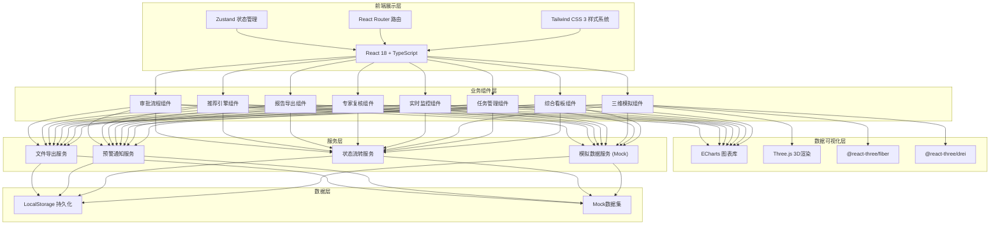
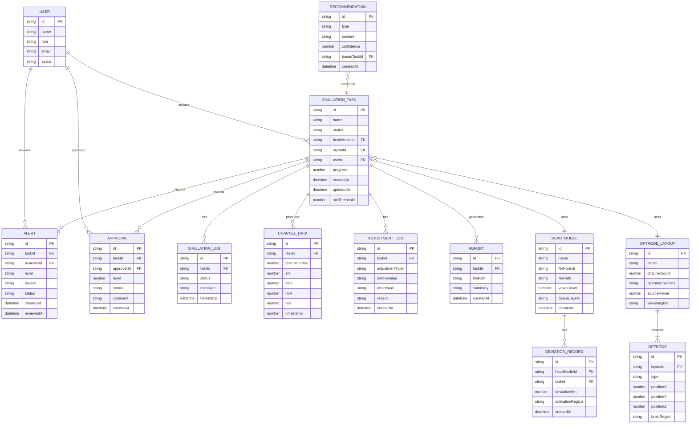

## 1. 架构设计



## 2. 技术描述

- **前端框架**：React 18 + TypeScript + Vite
- **状态管理**：Zustand 4（轻量级状态管理，支持中间件持久化）
- **样式方案**：Tailwind CSS 3 + CSS 变量（自定义深空蓝主题系统）
- **路由管理**：React Router DOM 6
- **图表可视化**：ECharts 5（折线图、柱状图、雷达图、热力图、面积图）
- **3D渲染引擎**：Three.js + @react-three/fiber + @react-three/drei + @react-three/postprocessing
- **图标库**：Lucide React
- **PDF生成**：jsPDF + html2canvas（报告导出）
- **数据导出**：xlsx（Excel导出）、PapaParse（CSV导出）
- **初始化工具**：vite-init（react-ts模板）
- **后端**：无（纯前端Mock数据模拟）
- **数据库**：LocalStorage持久化 + 内置Mock数据集

## 3. 路由定义

| 路由路径 | 页面名称 | 用途 |
|----------|----------|------|
| `/` | 综合看板 | 首页，展示日统计、性能雷达图、任务趋势、实时预警 |
| `/tasks` | 任务管理中心 | 任务列表、状态筛选、新建任务入口 |
| `/tasks/board` | 任务状态看板 | 六列状态流转看板，拖拽式管理 |
| `/tasks/new` | 新建模拟任务 | 四步向导式创建流程 |
| `/tasks/:id` | 任务详情页 | 任务全量信息、状态时间线、计算进度 |
| `/simulation` | 三维光传输模拟 | 头模上传、光极布局、网格生成、3D可视化 |
| `/simulation/:id` | 模拟任务视图 | 针对特定任务的模拟参数配置和3D视图 |
| `/monitor` | 实时监控中心 | SNR监控、血氧曲线、预警中心 |
| `/review` | 专家复核中心 | 待复核预警、调整方案、调整日志 |
| `/reports` | 报告与导出中心 | 报告预览、数据导出、历史报告 |
| `/recommend` | 智能推荐引擎 | 光极布局推荐、波长组合推荐 |
| `/approval` | 审批流程中心 | 两级审批、偏差监控、通知中心 |
| `/settings` | 系统设置 | 阈值配置、通知设置、账户管理 |

## 4. 数据模型

### 4.1 核心数据模型ER图



### 4.2 任务状态枚举

```typescript
enum TaskStatus {
  PENDING_VALIDATION = 'pending_validation',
  MESH_GENERATION = 'mesh_generation',
  LIGHT_TRANSPORT = 'light_transport',
  BLOOD_INVERSION = 'blood_inversion',
  COMPLETED = 'completed',
  ERROR_ROLLBACK = 'error_rollback',
  PENDING_APPROVAL_1 = 'pending_approval_1',
  PENDING_APPROVAL_2 = 'pending_approval_2',
  APPROVED = 'approved'
}
```

### 4.3 预警等级枚举

```typescript
enum AlertLevel {
  LEVEL_1 = 'level_1',
  LEVEL_2 = 'level_2',
  LEVEL_3 = 'level_3'
}
```

### 4.4 组织光学属性类型

```typescript
interface TissueOpticalProperty {
  layer: 'scalp' | 'skull' | 'csf' | 'gray_matter' | 'white_matter';
  absorptionCoefficient: number;
  scatteringCoefficient: number;
  anisotropy: number;
  refractiveIndex: number;
}
```

## 5. 项目目录结构

```
d:\6.17项目\704/
├── src/
│   ├── components/
│   │   ├── layout/              # 布局组件
│   │   │   ├── Sidebar.tsx
│   │   │   ├── TopBar.tsx
│   │   │   └── AppLayout.tsx
│   │   ├── common/              # 通用组件
│   │   │   ├── StatCard.tsx
│   │   │   ├── StatusBadge.tsx
│   │   │   ├── DataTable.tsx
│   │   │   └── ProgressRing.tsx
│   │   ├── dashboard/           # 看板组件
│   │   │   ├── PerformanceRadar.tsx
│   │   │   ├── TrendChart.tsx
│   │   │   └── AlertList.tsx
│   │   ├── tasks/               # 任务管理组件
│   │   │   ├── TaskBoard.tsx
│   │   │   ├── TaskCard.tsx
│   │   │   ├── TaskTable.tsx
│   │   │   ├── NewTaskWizard.tsx
│   │   │   └── TaskTimeline.tsx
│   │   ├── simulation/          # 三维模拟组件
│   │   │   ├── HeadModelUploader.tsx
│   │   │   ├── OptrodeLayoutEditor.tsx
│   │   │   ├── Brain3DViewer.tsx
│   │   │   ├── MeshGenerationPanel.tsx
│   │   │   └── OpticalPropertyEditor.tsx
│   │   ├── monitor/             # 实时监控组件
│   │   │   ├── SNRPanel.tsx
│   │   │   ├── BloodOxygenChart.tsx
│   │   │   └── AlertCenter.tsx
│   │   ├── review/              # 专家复核组件
│   │   │   ├── ReviewList.tsx
│   │   │   ├── AdjustmentPanel.tsx
│   │   │   └── AdjustmentLog.tsx
│   │   ├── reports/             # 报告组件
│   │   │   ├── ReportPreview.tsx
│   │   │   ├── OpticalDensityChart.tsx
│   │   │   ├── BloodOxygenHeatmap.tsx
│   │   │   └── DataExportPanel.tsx
│   │   ├── recommend/           # 推荐引擎组件
│   │   │   ├── LayoutRecommendation.tsx
│   │   │   └── WavelengthRecommendation.tsx
│   │   └── approval/            # 审批组件
│   │       ├── ApprovalList.tsx
│   │       ├── DeviationMonitor.tsx
│   │       └── NotificationCenter.tsx
│   ├── pages/
│   │   ├── Dashboard.tsx
│   │   ├── Tasks.tsx
│   │   ├── TaskBoard.tsx
│   │   ├── NewTask.tsx
│   │   ├── TaskDetail.tsx
│   │   ├── Simulation.tsx
│   │   ├── SimulationDetail.tsx
│   │   ├── Monitor.tsx
│   │   ├── Review.tsx
│   │   ├── Reports.tsx
│   │   ├── Recommend.tsx
│   │   ├── Approval.tsx
│   │   └── Settings.tsx
│   ├── store/
│   │   ├── useTaskStore.ts
│   │   ├── useUserStore.ts
│   │   ├── useAlertStore.ts
│   │   ├── useSimulationStore.ts
│   │   └── useReportStore.ts
│   ├── types/
│   │   ├── index.ts
│   │   ├── task.ts
│   │   ├── user.ts
│   │   ├── simulation.ts
│   │   └── report.ts
│   ├── utils/
│   │   ├── mockData.ts
│   │   ├── helpers.ts
│   │   ├── pdfGenerator.ts
│   │   └── dataExporter.ts
│   ├── hooks/
│   │   ├── useRealtimeData.ts
│   │   ├── useAlertMonitor.ts
│   │   └── useTaskProgress.ts
│   ├── App.tsx
│   ├── main.tsx
│   └── index.css
├── api/                          # (预留，当前无后端)
├── shared/
│   └── types/                    # 共享类型定义
├── vite.config.ts
├── tailwind.config.js
├── tsconfig.json
├── package.json
└── .trae/documents/
    ├── PRD-近红外光谱脑功能成像模拟平台.md
    └── 技术架构-近红外光谱脑功能成像模拟平台.md
```
